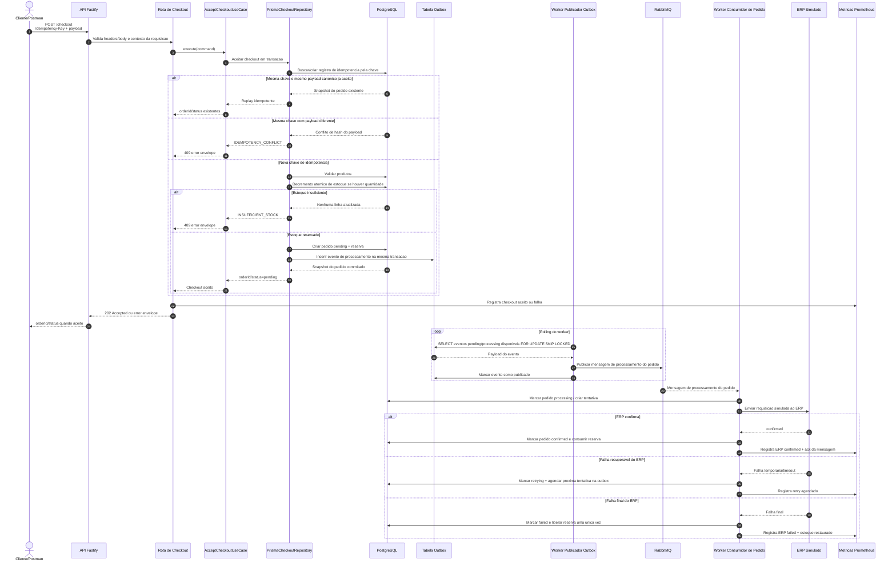

# POST /checkout

Pontos principais:

- O contrato HTTP e assincrono: sucesso retorna `202 Accepted` com `orderId` e status inicial.
- A venda alem do estoque e impedida antes da resposta por update condicional no PostgreSQL.
- A idempotencia protege retries e duplo clique via `Idempotency-Key` mais hash do payload canonico.
- A entrega ao ERP e simulada pelo worker usando outbox e RabbitMQ.
