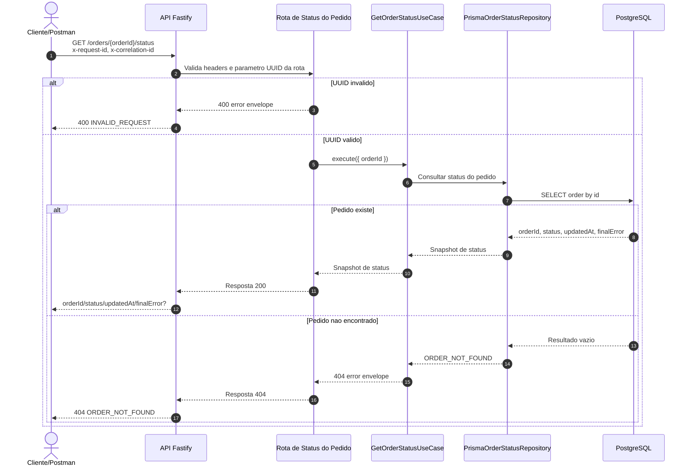

# GET /orders/{orderId}/status

Pontos principais:

- Esta rota e o contrato de polling para o fluxo assincrono de checkout.
- Os status validos sao `pending`, `processing`, `retrying`, `confirmed` e `failed`.
- `finalError` aparece apenas quando existe um motivo de falha terminal a expor.
