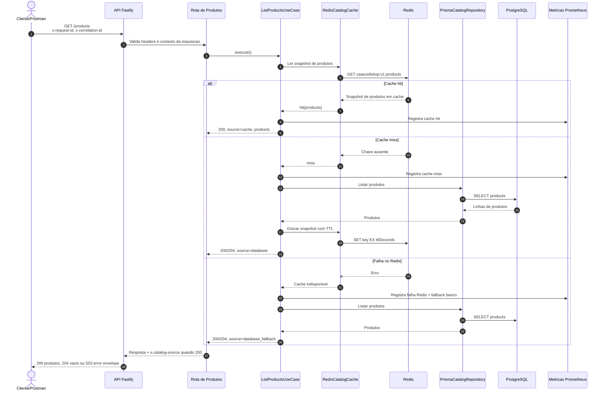

# GET /products

Pontos principais:

- O Redis conecta durante a inicializacao da API e permanece aberto durante a vida da aplicacao.
- O Redis atua apenas como cache-aside; o PostgreSQL continua sendo a fonte autoritativa.
- Um hit valido no Redis ignora o atraso artificial do PostgreSQL e retorna `x-catalog-source: cache`.
